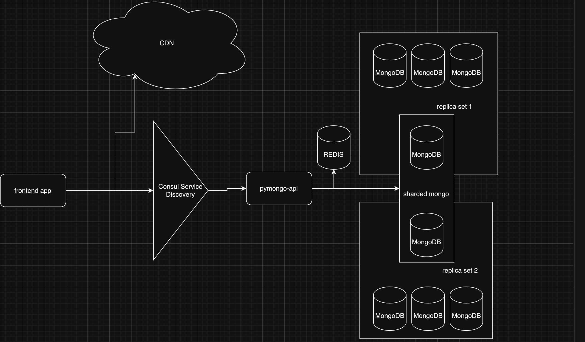

Для запуска приложения требуется:
1. перейти в директорию sharding-repl-cache
2. выполнить docker-compose up -d
3. дождаться( :) ), пока контейнер mongo-sharding-mongos_router_setup-1 перейдет в статус exited(он ждет 60 секунд после старта, затем вызывает команду для настройку роутера и отключается)
4. вызвать localhost:8080

